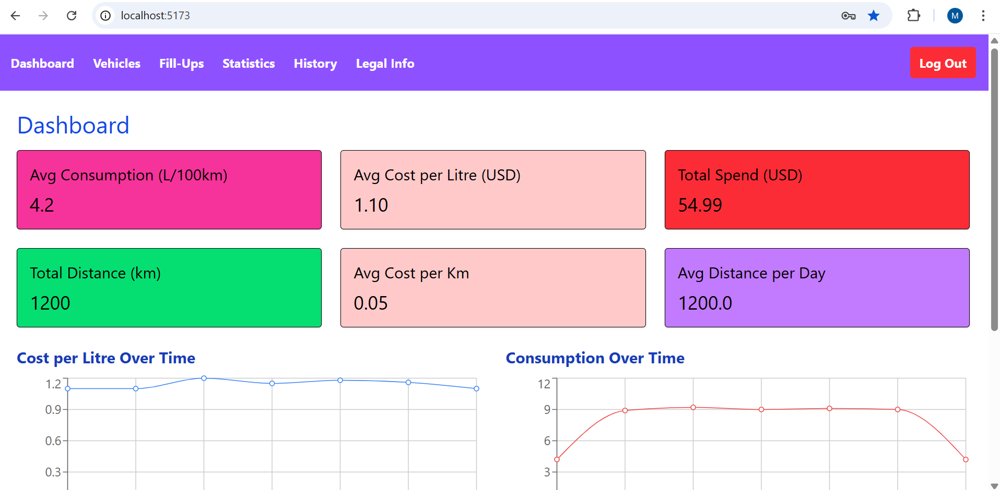
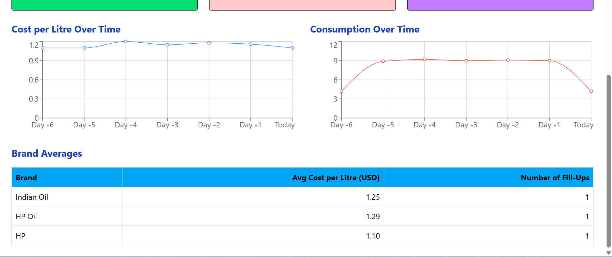
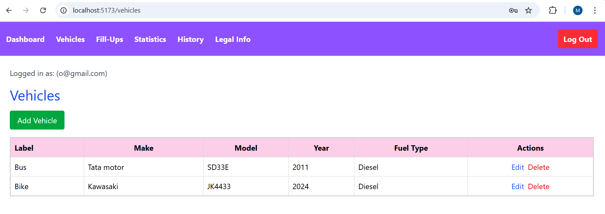
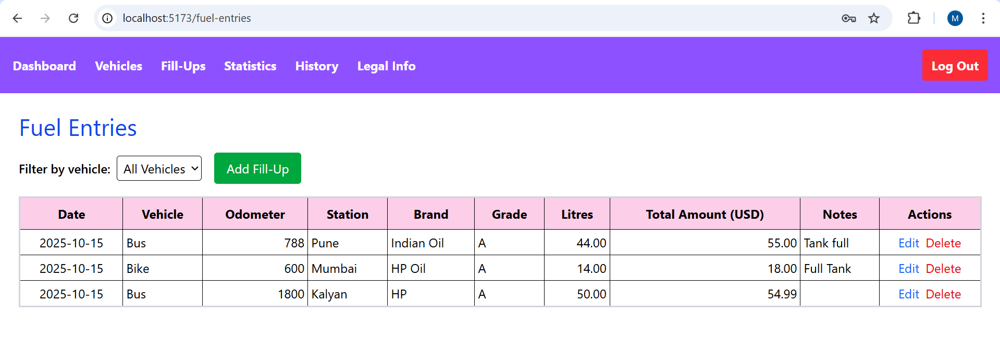
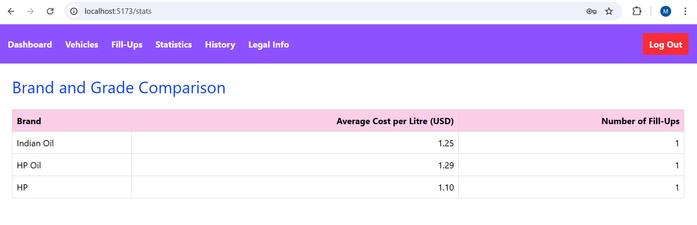
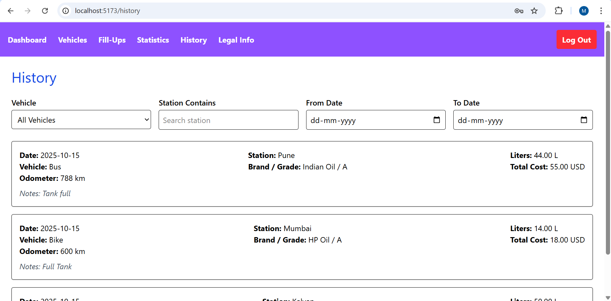
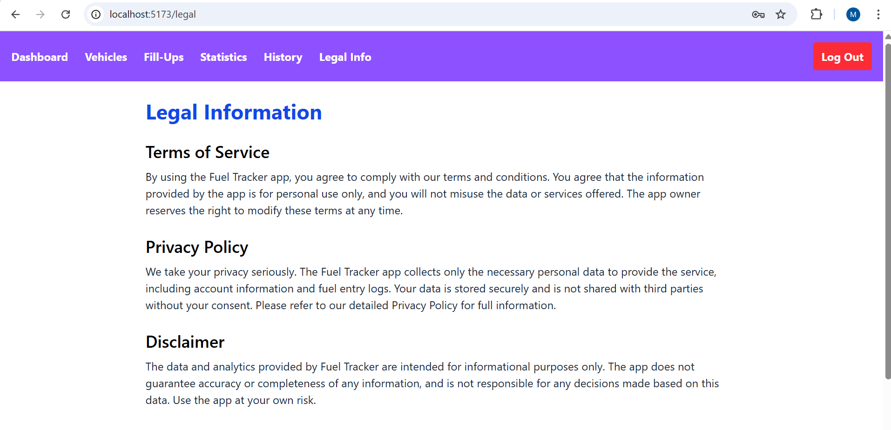
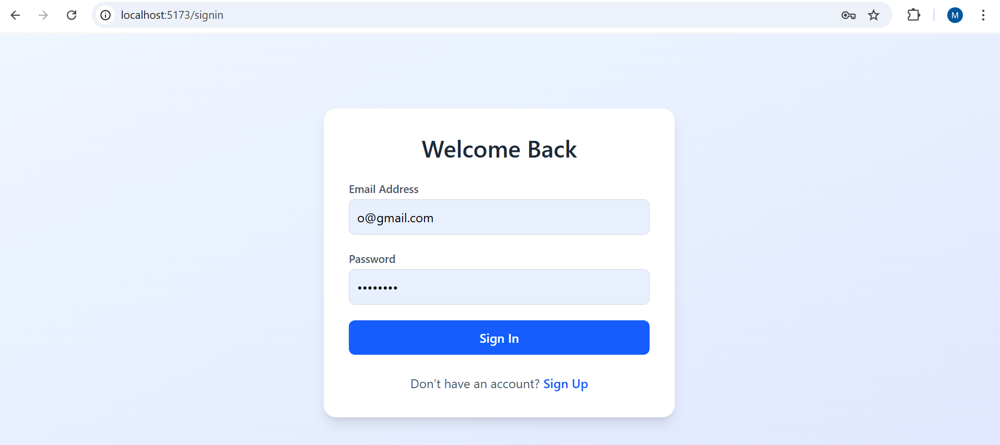

# Fuel_Tanker_DataArt_CodeFusion_2.0

## Overview

**Fuel_Tanker_DataArt_CodeFusion_2.0** is an enterprise-grade data management and analytics solution for monitoring, analyzing, and optimizing fuel tanker operations. Built on the **MERN stack** (MongoDB, Express, React, Node.js) and Dockerized for scalable deployments, it enables real-time monitoring, predictive analytics, and reporting.

**Key Features:**  
- Real-time tanker tracking and monitoring  
- Fuel consumption analysis and optimization  
- Predictive maintenance and anomaly detection  
- Cloud-ready Dockerized deployment  
- Enterprise-grade security and compliance support  

---

## Getting Started

Follow these steps to quickly set up the project in your environment.

### Prerequisites
- Git 2.30+  
- Node.js 18+  
- npm 9+  
- MongoDB 6+ (local or Dockerized)  
- Docker & Docker Compose  

---

## Clone Repository

```bash
git clone https://gitlab.dataart.com/okumar/fuel_tanker_dataart_codefusion_2.0.git


# 1. Install Dependencies

Setup & Running Locally

# Backend
cd backend
npm install

# Frontend
cd frontend
npm install

# 2. Configure Environment Variables
PORT=4000
MONGO_URI=mongodb://*************************************************/fuel_tanker
JWT_SECRET=********************










